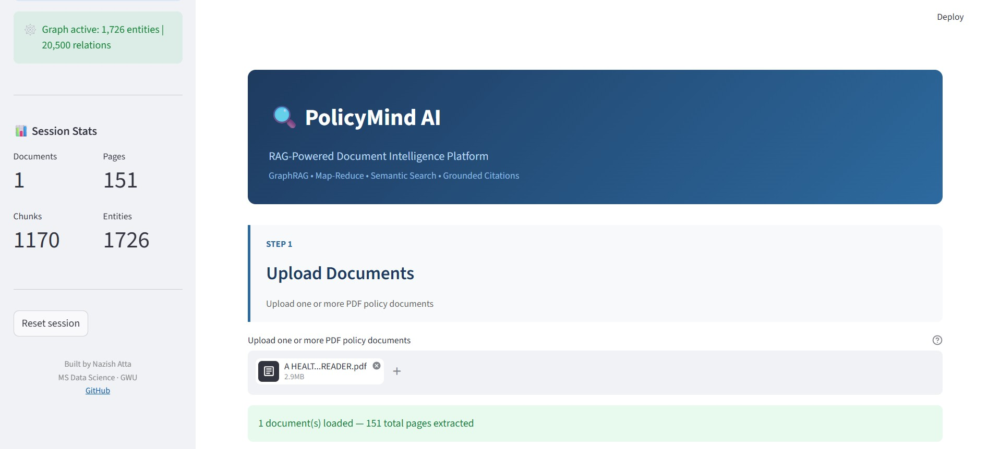
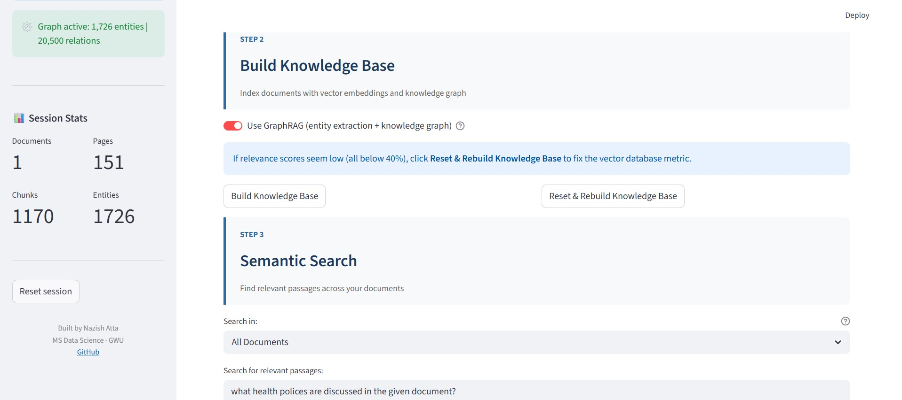
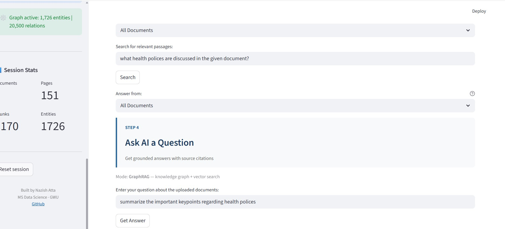
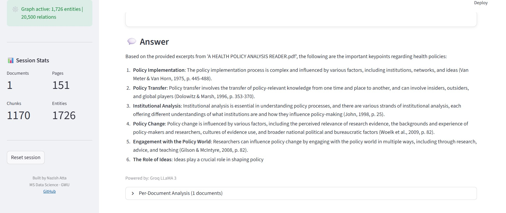
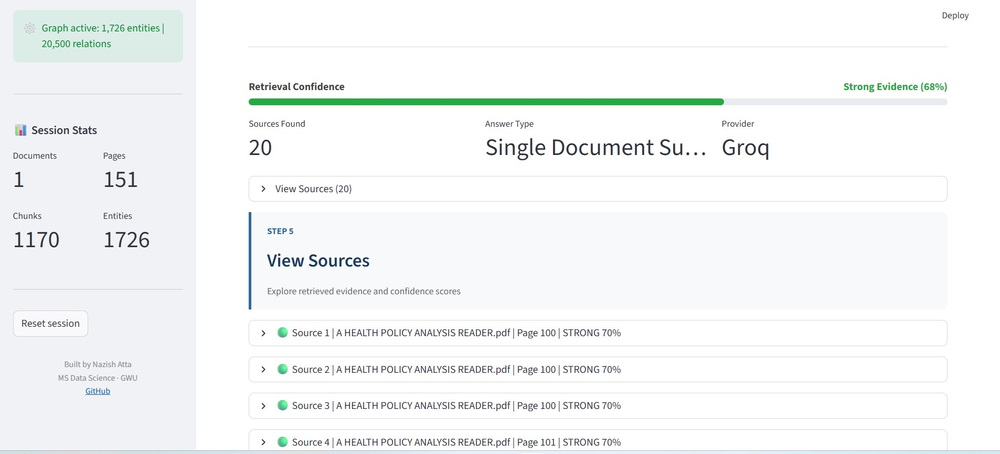
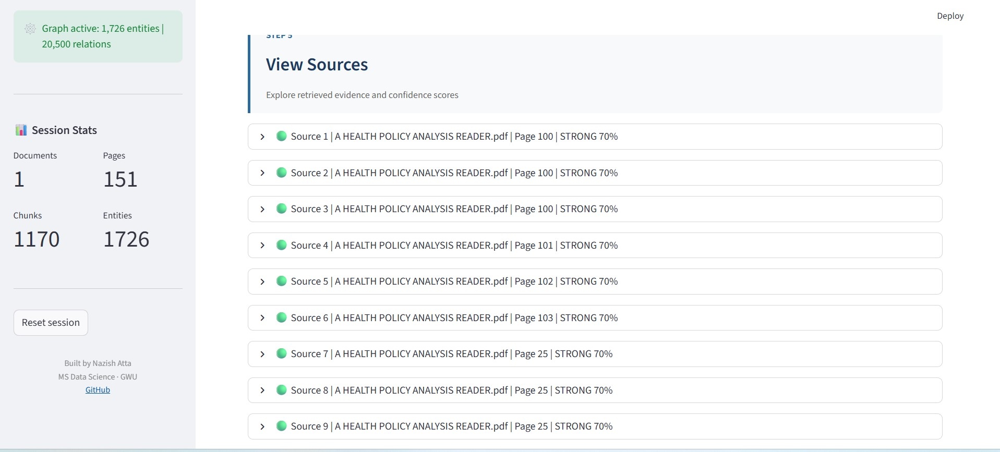
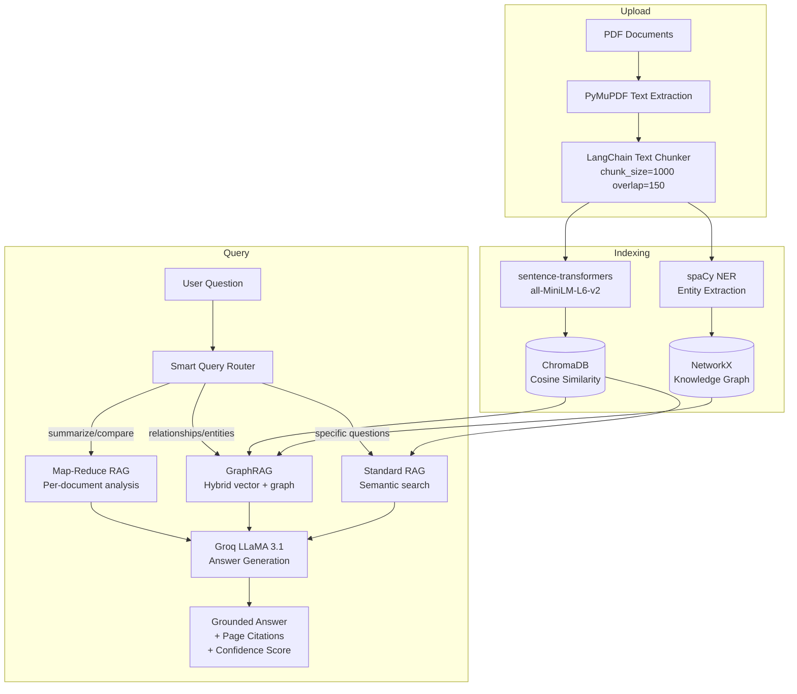

# PolicyMind AI

[](https://nazishatta-policymind-ai.hf.space/)

  [](https://huggingface.co/spaces/nazishatta/PolicyMind-AI)

**GraphRAG-powered policy document intelligence — semantic search, entity graphs, and citation-backed answers over complex public-policy corpora.**

[](https://www.python.org/downloads/)
[](LICENSE)
[](https://streamlit.io)

---

## Screenshots

### Application Interface


### GraphRAG Knowledge Base


### Intelligent Query Routing


### AI Answer with Citations


### Structured Analysis


### Retrieval Confidence


### Source Evidence


---

## The Problem

Public policy documents — climate agreements, regulatory frameworks, health directives — are long, cross-referential, and dense with named entities: agencies, dates, targets, obligations, and relationships between them. Researchers, analysts, and civic technologists need to navigate these corpora quickly and trace every claim back to its source.

Standard keyword search misses context. Generic chat-with-PDF tools produce confident-sounding answers with no audit trail. Neither approach surfaces the structural relationships that give policy text its meaning.

---

## Why Traditional RAG Is Not Enough

Standard Retrieval-Augmented Generation retrieves the most similar text chunks and passes them to an LLM. For policy analysis this falls short in several ways:

| Capability | Standard RAG | PolicyMind AI |
|---|---|---|
| Semantic search | ✓ | ✓ |
| Citation tracing (page · excerpt · score) | Partial | ✓ Structured citations with page numbers |
| Entity relationship graphs | ✗ | ✓ spaCy NER + NetworkX |
| Graph-augmented score fusion | ✗ | ✓ Hybrid vector + graph reranking (0.7/0.3) |
| Smart query routing | ✗ | ✓ Map-Reduce · GraphRAG · Standard |
| Multi-document comparative analysis | ✗ | ✓ Per-document Map phase + synthesis Reduce |
| Explainable confidence scores | ✗ | ✓ Visual progress bar with Strong/Moderate/Weak tiers |
| Provider flexibility | Varies | ✓ Groq LLaMA 3.1 primary, OpenAI GPT-4o-mini optional |

---

## What PolicyMind AI Does

PolicyMind AI is a Streamlit-based document intelligence platform that lets users upload policy PDF documents, build a semantic knowledge base, and ask natural language questions. The system retrieves relevant document passages using hybrid vector and graph search, then generates grounded answers with page-level source citations.

The pipeline has four stages: document ingestion (PyMuPDF), vector indexing (ChromaDB with cosine similarity), knowledge graph construction (spaCy NER + NetworkX), and answer generation (Groq LLaMA 3.1).

A smart query router automatically selects the best retrieval strategy: Map-Reduce for summarization and cross-document comparison, GraphRAG for relationship and entity queries, and standard semantic search for specific factual questions.

---

## Key Features

- **Smart query routing** — keyword-based classifier automatically routes to Map-Reduce, GraphRAG, or Standard RAG based on query intent
- **GraphRAG hybrid retrieval** — vector search fused with knowledge-graph entity re-ranking (70% vector weight, 30% graph boost)
- **Map-Reduce for multi-document queries** — processes each document independently in the Map phase, then synthesizes a cross-document answer in the Reduce phase
- **Grounded answers with page citations** — every answer includes document name, page number, relevance score, and verbatim text excerpt
- **Explainable confidence scores** — visual progress bar colour-coded as Strong (≥65%), Moderate (35–65%), or Weak (<35%)
- **Multi-document support** — upload multiple PDFs, all indexed into a shared knowledge base with per-document retrieval
- **Local embeddings** — `all-MiniLM-L6-v2` runs fully on CPU with no external API calls, keeping document content private by default
- **Graceful degradation** — falls back to standard vector search when spaCy or NetworkX are unavailable, with clear UI indicators

---

## Architecture



All pipeline components are resolved at startup from environment variables. No code changes are required to switch LLM providers.

---

## Tech Stack

| Layer | Technology | Purpose |
|---|---|---|
| Frontend | Streamlit | Web interface |
| PDF Parsing | PyMuPDF (fitz) | Text and page extraction |
| Chunking | LangChain | RecursiveCharacterTextSplitter (size=1000, overlap=150) |
| Embeddings | sentence-transformers | all-MiniLM-L6-v2, local CPU |
| Vector Database | ChromaDB | Cosine similarity search |
| Knowledge Graph | NetworkX | Entity relationship graph |
| Entity Extraction | spaCy | Named entity recognition (en_core_web_sm) |
| LLM | Groq LLaMA 3.1 | Answer generation (llama-3.1-8b-instant) |
| LLM Fallback | OpenAI GPT-4o-mini | Optional alternative provider |
| Language | Python 3.10+ | Core language |

---

## Quick Start

### Prerequisites
- Python 3.10 or higher
- Groq API key — free at [console.groq.com](https://console.groq.com)

### Installation

```powershell
# Clone the repository
git clone https://github.com/nazishatta/PolicyMind-AI-RAG-Powered-Document-Intelligence-Platform
cd PolicyMind-AI-RAG-Powered-Document-Intelligence-Platform

# Create virtual environment
python -m venv .venv
.venv\Scripts\Activate.ps1

# Install dependencies
pip install -r requirements.txt
python -m spacy download en_core_web_sm

# Configure environment
copy .env.example .env
# Edit .env and add your GROQ_API_KEY

# Run the application
streamlit run app/streamlit_app.py
```

Open **http://localhost:8501** in your browser.

> **Note:** spaCy is optional. Without it, GraphRAG falls back to vector-only mode and entity extraction is skipped. All other features work normally.

---

## Environment Variables

| Variable | Required | Description |
|---|---|---|
| `GROQ_API_KEY` | Yes | Groq API key from [console.groq.com](https://console.groq.com) |
| `OPENAI_API_KEY` | No | OpenAI fallback (optional) |
| `CHROMA_DB_PATH` | No | ChromaDB storage path (default: `vector_db/chroma`) |
| `EMBEDDING_MODEL_NAME` | No | Embedding model (default: `sentence-transformers/all-MiniLM-L6-v2`) |
| `CHUNK_SIZE` | No | Characters per chunk (default: `1000`) |
| `CHUNK_OVERLAP` | No | Overlap between chunks (default: `150`) |
| `TOP_K_RESULTS` | No | Chunks retrieved per query (default: `5`) |

Full reference: [`.env.example`](.env.example)

No secrets are committed to this repository.

---

## How to Use

1. **Upload Documents** — Upload one or more PDF policy documents using the file uploader. Multiple files are indexed together into a shared knowledge base.
2. **Build Knowledge Base** — Click **Reset & Rebuild Knowledge Base** to index documents with vector embeddings. Optionally enable GraphRAG to also build a knowledge graph.
3. **Semantic Search** — Search for relevant passages across your documents to preview retrieval quality before asking questions.
4. **Ask Questions** — Ask natural language questions. The smart router automatically selects the best strategy:
   - *Map-Reduce* is triggered by words like "summarize", "compare", "overview", "across documents"
   - *GraphRAG* is triggered by words like "relationship", "organization", "between", "responsible for"
   - *Standard RAG* handles all other specific factual questions
5. **View Sources** — Every answer includes document name, page number, relevance score, and a verbatim excerpt for every retrieved passage.

### Example Questions

```
"What are the main policy objectives in this document?"
"Which organizations are responsible for implementation?"
"What are the key recommendations?"
"Summarize the main findings across all documents"
"Compare the policy approaches across uploaded documents"
"What is the relationship between [Agency A] and [Agency B]?"
"What evidence supports the conclusions on page 12?"
"What emission reduction targets are committed to by 2030?"
```

---

## Responsible AI and Trust Layer

PolicyMind AI is designed to behave like a careful research assistant: useful, transparent, and source-grounded. Five trust mechanisms are built directly into the Streamlit pipeline:

| Mechanism | Implementation |
|---|---|
| **Visual confidence scoring** | Every answer displays a colour-coded progress bar — green (≥65% Strong), yellow (35–65% Moderate), red (<35% Weak) — computed from retrieved chunk similarity scores |
| **Page-level citations** | Every source card shows document name, page number, cosine relevance score, and a verbatim excerpt — no claims without evidence |
| **Answer type classification** | Badge on every response: Document Answer · Map-Reduce · GraphRAG · Partial Answer · Evidence Only — signals how grounded the answer is |
| **Routing transparency** | UI displays which retrieval strategy was used (Standard RAG / Map-Reduce / GraphRAG) and why, so users understand the evidence path |
| **Evidence-only fallback** | When no LLM API key is configured, the system returns raw retrieved passages instead of generating an answer — the primary hallucination pathway is blocked at the source |

**What these mechanisms do not guarantee:** hallucinations remain possible with any LLM provider; retrieval is incomplete when the corpus is incomplete; confidence scores are heuristic, not calibrated probabilities. All outputs should be verified against original source documents.

---

## Project Structure

```
PolicyMind-AI/
├── app/
│   ├── streamlit_app.py         # Main Streamlit application entry point
│   └── components/
│       ├── chat_ui.py           # Step 4: Q&A panel, answer card, confidence bar
│       ├── source_display.py    # Step 5: Source evidence cards
│       ├── upload_ui.py         # Step 1: PDF upload and document preview
│       └── ui_helpers.py        # Shared step header renderer
├── src/
│   ├── config.py                # Environment variable configuration
│   ├── document_loader.py       # PyMuPDF PDF processing (multi-file)
│   ├── text_splitter.py         # LangChain RecursiveCharacterTextSplitter
│   ├── vector_store.py          # ChromaDB create / query / reset
│   ├── retriever.py             # Semantic search + retrieval quality scoring
│   ├── rag_chain.py             # Standard RAG pipeline + Groq/OpenAI integration
│   ├── graph_rag.py             # GraphRAG: spaCy NER + NetworkX + hybrid search
│   ├── map_reduce_rag.py        # Map-Reduce pipeline + smart query router
│   ├── citation_utils.py        # Source formatting helpers
│   └── logger.py                # Structured logging setup
├── docs/
│   └── Screenshots/             # Application screenshots
├── data/
│   └── raw/                     # Uploaded PDF storage (gitignored)
├── vector_db/
│   └── chroma/                  # ChromaDB persistent storage (gitignored)
├── requirements.txt             # Python dependencies
├── .env.example                 # Environment variable template
└── README.md
```

---

## Roadmap

- [ ] **Streaming responses** — server-sent events for long LLM completions
- [ ] **Additional LLM providers** — Anthropic Claude, Mistral, and local Ollama support
- [ ] **Fine-tuned NER** — domain-adapted entity extraction for policy terminology
- [ ] **Non-English support** — multilingual embeddings for EU and UN document corpora
- [ ] **Async ingestion** — background task processing for large PDF batches
- [ ] **Persistent graph export** — GraphML / RDF serialisation for graph portability
- [ ] **Evaluation harness** — labeled Q&A pairs over public policy corpora for retrieval benchmarking

---

## Contributing

Contributions are welcome. Before opening a large PR, please open an issue to discuss scope and approach.

High-priority areas: additional LLM providers, multilingual support, and annotated evaluation datasets.

---

## License

[MIT](LICENSE) — free for research, education, and civic technology use.
