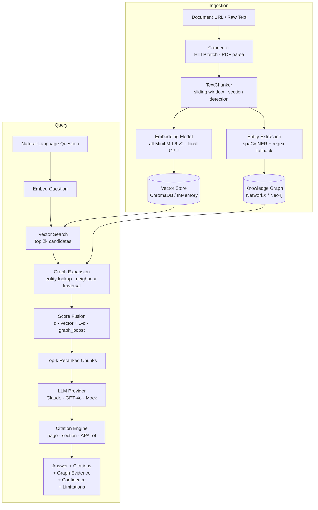

# PolicyMind-AI

**GraphRAG-powered policy document intelligence — semantic search, entity graphs, and citation-backed answers over complex public-policy corpora.**

[](https://github.com/nazishatta/PolicyMind-AI-RAG-Powered-Document-Intelligence-Platform/actions)
[](https://www.python.org/downloads/)
[](#running-tests)
[](LICENSE)
[](https://github.com/astral-sh/ruff)

---

## The Problem

Public policy documents — climate agreements, regulatory frameworks, health directives — are long, cross-referential, and dense with named entities: agencies, dates, targets, obligations, and relationships between them. Researchers, analysts, and civic technologists need to navigate these corpora quickly and trace every claim back to its source.

Standard keyword search misses context. Generic chat-with-PDF tools produce confident-sounding answers with no audit trail. Neither approach surfaces the structural relationships that give policy text its meaning.

---

## Why Traditional RAG Is Not Enough

Standard Retrieval-Augmented Generation retrieves the most similar text chunks and passes them to an LLM. For policy analysis this falls short in three ways:

| Capability | Standard RAG | PolicyMind-AI |
|---|---|---|
| Semantic search | ✓ | ✓ |
| Citation tracing (page, section, excerpt) | Partial | ✓ Structured citations (page · section · excerpt · score) |
| Entity relationship graphs | ✗ | ✓ NetworkX / Neo4j |
| Graph-augmented score fusion | ✗ | ✓ Hybrid vector + graph reranking |
| Explainable confidence scores | ✗ | ✓ Per-query confidence with breakdown |
| Limitations surfaced per query | ✗ | ✓ Deterministic limitations inference |
| Provider flexibility | Varies | ✓ Anthropic, OpenAI, or offline mock |
| Zero-dependency test suite | Varies | ✓ 398 tests, no API keys required |

---

## What PolicyMind-AI Does

PolicyMind-AI is a modular, API-first GraphRAG platform with four core stages:

**Ingestion** — A document arrives as a PDF URL or raw text. The pipeline fetches it, extracts structured text (pdfplumber), segments it into overlapping chunks preserving section headings and page numbers, embeds each chunk locally using `all-MiniLM-L6-v2`, and indexes the embeddings in ChromaDB or an in-memory store.

**Knowledge graph construction** — spaCy NER (with a regex fallback) extracts named entities from each chunk. Co-occurrence heuristics produce typed relations. Entities and edges are written to a NetworkX graph (or Neo4j for persistence).

**Hybrid retrieval** — On each query the `HybridRetriever` fetches 2× candidate chunks by cosine similarity, extracts named entities from those chunks, walks the graph neighbourhood up to `graph_depth` hops, and fuses vector and graph scores:

```
fused_score = α · vector_score + (1 − α) · graph_boost
```

`α` defaults to 0.7 and is env-configurable. `graph_boost` is proportional: it reflects how many of the query's relevant entities appear in the chunk, weighted by edge confidence. `graph_depth` (1–3, default 1) controls how many hops of indirect evidence are collected; multi-hop edges are confidence-discounted by 0.8 per hop. The top-k reranked results are returned alongside the graph evidence that influenced them.

**Answer generation** — Retrieved chunks are assembled into a structured prompt. The configured LLM (Claude, GPT-4o, or the offline mock) generates a grounded answer. The citation engine records chunk ID, doc ID, page number, section heading, relevance score, and structured citation for every passage referenced. A confidence score and deterministic limitations list are computed from retrieval statistics and returned alongside the answer.

---

## Key Features

- **GraphRAG hybrid retrieval** — vector search + knowledge-graph neighbourhood expansion fused into a single reranked result set
- **Full citation trail** — every answer includes chunk IDs, page numbers, section headings, relevance scores, and verbatim excerpts
- **Explainable confidence** — per-query confidence derived from top-3 chunk similarity and graph evidence depth, with a plain-English limitations list
- **Provider-agnostic LLM layer** — swap between Anthropic Claude, OpenAI GPT, and an offline mock by changing one environment variable
- **Local embeddings** — `all-MiniLM-L6-v2` runs on CPU with no external API calls, keeping document content private by default
- **API-first design** — every capability exposed through a typed FastAPI REST API with OpenAPI documentation
- **Zero-dependency test suite** — 398 tests across 11 modules run entirely offline with in-memory providers and a mock LLM
- **Structured error handling** — typed `IngestionError` subclasses map to appropriate HTTP status codes (413, 415, 422, 502)
- **Pydantic v2 throughout** — request/response schemas validated at the boundary; internal types are dataclasses

---

## Architecture



All provider choices — LLM, vector store, graph — are resolved at startup from environment variables. No code changes are required to switch between providers.

---

## Tech Stack

| Layer | Library | Notes |
|---|---|---|
| API framework | FastAPI 0.111+ | OpenAPI docs auto-generated from Pydantic schemas |
| Validation | Pydantic v2 + pydantic-settings | Strict boundary validation; env-var config |
| Embeddings | sentence-transformers (all-MiniLM-L6-v2) | Local, CPU-compatible, no API calls |
| Vector store | ChromaDB · InMemory | Persistent (Chroma) or ephemeral (tests) |
| Knowledge graph | NetworkX · Neo4j | Switchable at runtime; NetworkX needs no setup |
| Entity extraction | spaCy en_core_web_sm | Regex fallback when spaCy model unavailable |
| LLM providers | Anthropic Claude · OpenAI · Mock | Uniform provider interface; mock is fully offline |
| PDF parsing | pdfplumber + PyPDF2 | Structured text extraction with page metadata |
| Testing | pytest + pytest-asyncio | 398 tests; async test support; no external deps |
| Linting / typing | ruff · mypy | Enforced in CI |
| Logging | structlog | Structured JSON logs in production |

---

## Quick Start

### Option A — GitHub Codespaces (zero local setup)

Click **Code → Codespaces → Create codespace**. The `.devcontainer` configuration installs all dependencies automatically and sets mock-mode environment variables so the server starts with no API keys required.

Once the container is ready, open a terminal and run:

```bash
PYTHONPATH=backend uvicorn backend.app.main:app --reload --port 8000
```

Open the **Ports** tab and forward port 8000. Visit `/docs` for the interactive Swagger UI, or run the smoke test:

```bash
python scripts/smoke_test.py
```

### Option B — Local virtual environment

```bash
git clone https://github.com/nazishatta/PolicyMind-AI-RAG-Powered-Document-Intelligence-Platform
cd PolicyMind-AI-RAG-Powered-Document-Intelligence-Platform

python -m venv .venv
source .venv/bin/activate       # Windows: .venv\Scripts\activate

pip install -e ".[dev]"
python -m spacy download en_core_web_sm   # optional — regex fallback used if absent

cp .env.example .env            # default is mock mode — no API key needed
PYTHONPATH=backend uvicorn backend.app.main:app --reload --port 8000
# Windows PowerShell: $env:PYTHONPATH="backend"; uvicorn backend.app.main:app --reload --port 8000
```

Open **http://localhost:8000/docs** — the full API is browsable and executable from the Swagger UI.

**Verify the full pipeline in one command** (new terminal, no API key required):

```bash
python scripts/smoke_test.py
```

The smoke test runs 9 steps — health, ingestion, query with trust-layer checks, graph inspection, and input validation — and exits 0 on success.

---

## Environment Variables

The server runs fully offline in mock mode with the defaults below. To use a real LLM, set the provider and its API key in `.env`.

| Variable | Default | Description |
|---|---|---|
| `LLM_PROVIDER` | `mock` | `mock` · `anthropic` · `openai` |
| `ANTHROPIC_API_KEY` | — | Required when `LLM_PROVIDER=anthropic` |
| `OPENAI_API_KEY` | — | Required when `LLM_PROVIDER=openai` |
| `ANTHROPIC_MODEL` | `claude-sonnet-4-6` | Override Claude model |
| `OPENAI_MODEL` | `gpt-4o` | Override OpenAI model |
| `VECTOR_STORE_PROVIDER` | `chroma` | `chroma` (persistent) · `memory` |
| `GRAPH_PROVIDER` | `memory` | `memory` (NetworkX) · `neo4j` |
| `NEO4J_URI` | `bolt://localhost:7687` | Neo4j bolt URI |
| `GRAPH_VECTOR_ALPHA` | `0.7` | Score fusion weight (0 = graph only, 1 = vector only) |
| `CHUNK_SIZE` | `512` | Target characters per chunk |
| `TOP_K_CHUNKS` | `5` | Chunks retrieved per query |
| `MAX_DOCUMENT_SIZE_MB` | `50` | Per-request document size cap |

Full reference: [`.env.example`](.env.example)

No secrets are committed to this repository.

---

## API Usage Examples

### Ingest a document

```bash
curl -X POST http://localhost:8000/api/v1/ingest \
  -H "Content-Type: application/json" \
  -d '{
    "text": "Section 1: Scope. This framework applies to all signatory states. Section 2: Targets. States shall reduce net emissions by 45 percent relative to 2005 levels by 2030. Section 3: Accountability. Annual progress reports are mandatory under Article 12.",
    "title": "National Emissions Reduction Framework 2024",
    "source_label": "Environment Ministry"
  }'
```

```json
{
  "doc_id": "a3f1c9e2",
  "title": "National Emissions Reduction Framework 2024",
  "chunk_count": 6,
  "entities_extracted": 11,
  "graph_nodes_added": 4,
  "processing_status": "completed"
}
```

### Query the corpus

```bash
# Basic query — searches all ingested documents
curl -X POST http://localhost:8000/api/v1/query \
  -H "Content-Type: application/json" \
  -d '{"question": "What emission reduction targets are committed to by 2030?"}'

# Multi-hop graph expansion — also collects 1-hop neighbour edges
curl -X POST http://localhost:8000/api/v1/query \
  -H "Content-Type: application/json" \
  -d '{"question": "Which agencies enforce just transition obligations?",
       "include_graph_evidence": true, "graph_depth": 2}'
```

### Inspect a document

```bash
curl http://localhost:8000/api/v1/documents/a3f1c9e2
```

### Check system health

```bash
curl http://localhost:8000/health
```

Full step-by-step demo: [docs/demo_walkthrough.md](docs/demo_walkthrough.md) | Sample payloads: [examples/sample_api_payloads.json](examples/sample_api_payloads.json)

---

## Example Questions

The following queries illustrate the kinds of analysis PolicyMind-AI is designed to support:

```
"What emission reduction targets are committed to by 2030?"
"Which agencies are responsible for enforcement under Article 12?"
"How does this framework define 'net zero' and what timeline is specified?"
"What financial mechanisms are described for just transition support?"
"Are there explicit penalties for non-compliance, and who administers them?"
"Which sections address adaptation measures versus mitigation obligations?"
```

---

## Example Citation-Backed Answer

```json
{
  "query_id": "q-7b3d1a",
  "question": "What emission reduction targets are committed to by 2030?",
  "answer": "According to the National Emissions Reduction Framework 2030 (p.1, Section 2), signatory states are committed to reducing greenhouse gas emissions by 45 percent relative to 2005 levels by 2030 (p.1). Annual progress reporting is mandatory under Article 12 (p.2).",

  "answer_type": "cited",
  "evidence_quality": "strong",
  "confidence_note": "Derived from 3 retrieved passages (mean top-3 cosine similarity: 0.84), with +0.10 boost from 2 graph triples. Evidence quality is strong.",

  "citations": [
    {
      "chunk_id": "a3f1c9e2-p001-c001",
      "doc_id": "a3f1c9e2",
      "doc_title": "National Emissions Reduction Framework 2030",
      "page_number": 1,
      "section_heading": "Section 2: Targets",
      "excerpt": "States shall reduce net emissions by 45 percent relative to 2005 levels by 2030...",
      "relevance_score": 0.9142
    }
  ],
  "retrieved_chunks": [
    {
      "chunk_id": "a3f1c9e2-p001-c001",
      "doc_id": "a3f1c9e2",
      "doc_title": "National Emissions Reduction Framework 2030",
      "page_number": 1,
      "section_heading": "Section 2: Targets",
      "text": "States shall reduce net emissions by 45 percent relative to 2005 levels by 2030...",
      "relevance_score": 0.9142
    }
  ],
  "graph_evidence": [
    {
      "entity": "2030 Target",
      "relation": "MENTIONED_WITH",
      "target": "Article 12",
      "source_doc_id": "a3f1c9e2",
      "confidence": 0.9
    }
  ],
  "confidence": 0.94,
  "limitations": [],
  "latency_ms": 138.4,
  "provider": "anthropic",
  "model": "claude-sonnet-4-6"
}
```

Every answer includes structured trust-layer fields: `answer_type` (`cited` / `partial` / `refused` / `no_corpus`), `evidence_quality` (`strong` / `moderate` / `weak` / `insufficient`), `confidence_note` (human-readable explanation), `citations` with exact page references, and a `limitations` list computed deterministically from retrieval statistics — never generated by the LLM.

---

## Evaluation Framework

PolicyMind-AI measures quality across four dimensions. The evaluation design is documented in [docs/evaluation_framework.md](docs/evaluation_framework.md).

| Dimension | Metric | Description |
|---|---|---|
| Retrieval quality | Recall@k, MRR | Fraction of gold relevant chunks in top-k results |
| Answer faithfulness | LLM-as-judge (1–5) | Claims traceable to retrieved context |
| Citation coverage | Precision · Recall | SUPPORTS / PARTIAL / SPURIOUS annotation |
| Graph utility | Augmentation rate | Queries where graph evidence contributed context |

The benchmark script accepts a JSONL file of labeled query–chunk pairs:

```bash
python scripts/benchmark.py \
  --queries examples/sample_queries.md \
  --report  outputs/eval_report.json
```

Evaluation datasets are not bundled. Researchers are encouraged to use publicly licensed corpora such as EUR-Lex (CC BY 4.0), UNDP Policy Documents, or UK Government Publications.

---

## Responsible AI and Trust Layer

PolicyMind-AI is designed to behave like a careful research assistant: useful, transparent, and entirely source-grounded. Eight trust mechanisms are implemented directly in the pipeline:

| Mechanism | Implementation |
|---|---|
| **Citation-first generation** | System prompt mandates inline page citations before and after every factual claim |
| **Refusal without corpus** | Pipeline skips the LLM entirely when no passages are found — the primary hallucination pathway is eliminated at the gate |
| **Confidence notes** | Every response carries a human-readable `confidence_note` explaining the cosine similarity, passage count, and graph boost |
| **Evidence quality label** | `evidence_quality` classifies each response as `strong`, `moderate`, `weak`, or `insufficient` |
| **Answer type classification** | `answer_type` signals `cited`, `partial`, `refused`, or `no_corpus` for programmatic handling |
| **Low-evidence preamble** | When confidence < 0.35, the LLM is instructed to prefix its answer with "Based on limited evidence:" |
| **Source traceability** | `citations` and `retrieved_chunks` expose every passage used, with `chunk_id`, `doc_id`, `page_number`, and verbatim text |
| **Deterministic limitations** | A `limitations` list is computed from retrieval statistics — not generated by the LLM — and is always present when applicable |

**What these mechanisms do not guarantee:** hallucinations remain possible with any LLM provider; retrieval is incomplete when the corpus is incomplete; confidence scores are heuristic, not calibrated probabilities. All outputs should be verified against original source documents.

Full discussion: [docs/responsible_ai.md](docs/responsible_ai.md)

---

## Running Tests

The full test suite runs offline — no API keys, no external services, no large downloads.

```bash
# All 398 tests
python -m pytest backend/tests/ -v

# With coverage report
python -m pytest backend/tests/ --cov=backend/app --cov-report=term-missing

# Single module
python -m pytest backend/tests/test_retriever.py -v

# Lint
ruff check backend/

# Type check
mypy backend/app/
```

| Module | Tests | Covers |
|---|---|---|
| `test_api.py` | 73 | All FastAPI endpoints end-to-end |
| `test_ingestion.py` | 70 | Ingest route edge cases and error handling |
| `test_trust_layer.py` | 61 | Trust-layer fields, refusal shortcut, confidence |
| `test_evaluation.py` | 59 | Retrieval metrics, faithfulness, citation coverage |
| `test_graph_service.py` | 25 | Entity/relation CRUD, neighbour traversal |
| `test_citation_engine.py` | 19 | Accumulation, structured citations, clamping |
| `test_connectors.py` | 19 | HTTP and text connectors |
| `test_retriever.py` | 19 | Hybrid retrieval, proportional boost, multi-hop expansion |
| `test_document_loader.py` | 12 | PDF and plain-text parsing |
| `test_text_chunker.py` | 11 | Chunking, overlap, section detection |
| `test_rag_pipeline.py` | 30 | Full pipeline: ingest, query, trust layer, document management |
| **Total** | **398** | |

---

## Roadmap

Items below are planned but not yet implemented:

- [ ] **Frontend** — Streamlit or lightweight React interface for interactive document Q&A
- [ ] **Additional LLM providers** — Cohere, Mistral, and local Ollama support
- [ ] **Async ingestion queue** — background task processing for large PDF batches
- [ ] **Fine-tuned NER** — domain-adapted entity extraction for policy terminology
- [ ] **Non-English support** — multilingual embeddings and chunking for EU and UN document corpora
- [ ] **Labeled evaluation dataset** — annotated Q&A pairs over public policy corpora
- [ ] **Persistent graph export** — GraphML / RDF serialisation for graph portability
- [ ] **Streaming query responses** — server-sent events for long LLM completions

---

## Repository Structure

```
PolicyMind-AI/
├── backend/
│   ├── app/
│   │   ├── main.py              # FastAPI app factory and lifespan
│   │   ├── config.py            # Pydantic Settings (env-var driven)
│   │   ├── api/
│   │   │   ├── dependencies.py  # lru_cache pipeline singleton
│   │   │   └── routes/
│   │   │       ├── root.py      # GET /
│   │   │       ├── health.py    # GET /health
│   │   │       ├── ingest.py    # POST /ingest · GET/DELETE /documents
│   │   │       ├── query.py     # POST /query
│   │   │       └── graph.py     # GET /graph/stats · /graph/neighbours
│   │   ├── core/
│   │   │   ├── connectors.py        # HTTP + text document connectors
│   │   │   ├── document_loader.py   # PDF/text parsing with typed errors
│   │   │   ├── text_chunker.py      # Sliding-window chunker, section detection
│   │   │   ├── embeddings.py        # sentence-transformers wrapper
│   │   │   ├── entity_extraction.py # spaCy NER + regex fallback
│   │   │   ├── citation_engine.py   # Structured citations, relevance clamping
│   │   │   └── retriever.py         # HybridRetriever — score fusion
│   │   ├── services/
│   │   │   ├── llm_service.py       # Provider interface (Anthropic/OpenAI/Mock)
│   │   │   ├── vector_store.py      # ChromaDB + InMemory implementations
│   │   │   ├── graph_service.py     # NetworkX + Neo4j implementations
│   │   │   └── rag_pipeline.py      # GraphRAGPipeline orchestrator
│   │   └── schemas/
│   │       ├── document.py          # IngestRequest/Response, DocumentDetail
│   │       ├── query.py             # QueryRequest
│   │       └── response.py          # AnswerResponse, HealthResponse, RootResponse
│   └── tests/                       # pytest suite (11 modules, 398 tests)
├── docs/
│   ├── api_usage.md             # Full endpoint reference with curl + Python examples
│   ├── architecture.md          # System design and data flow
│   ├── evaluation_framework.md  # Retrieval, faithfulness, citation metrics
│   ├── responsible_ai.md        # Limitations, bias, data handling
│   └── demo_walkthrough.md      # Step-by-step demo guide
├── examples/                    # Sample queries and API payloads
├── scripts/                     # Smoke test, benchmark runner
├── .github/                     # CI workflow, issue templates, PR template
├── pyproject.toml               # Build config, pytest settings, ruff, mypy
└── .env.example                 # All config variables with documented defaults
```

---

## Documentation

| Document | Description |
|---|---|
| [docs/api_usage.md](docs/api_usage.md) | Endpoint reference — every route with curl and Python examples |
| [docs/architecture.md](docs/architecture.md) | System design and component data-flow |
| [docs/evaluation_framework.md](docs/evaluation_framework.md) | Retrieval, faithfulness, citation, and graph utility metrics |
| [docs/responsible_ai.md](docs/responsible_ai.md) | Limitations, bias considerations, and data handling |
| [docs/demo_walkthrough.md](docs/demo_walkthrough.md) | Step-by-step demo from cold start to answered query |

---

## Contributing

Contributions are welcome. Before opening a large PR, please open an issue to discuss scope and approach. See [CONTRIBUTING.md](CONTRIBUTING.md) for setup instructions and code style guidelines.

High-priority areas: additional LLM providers, multilingual support, a frontend demo interface, and annotated evaluation datasets.

---

## License

[MIT](LICENSE) — free for research, education, and civic technology use.
